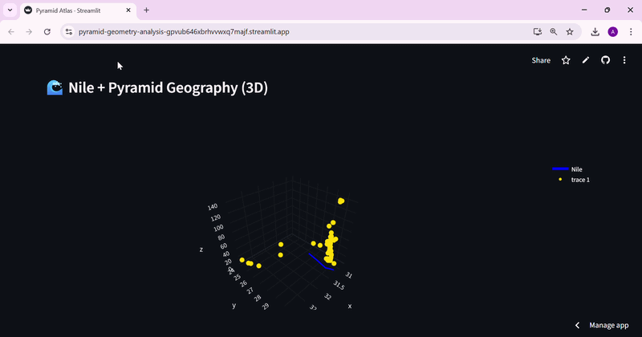

# Ancient-to-Cosmos Discovery Lab
Machine Learning for Hidden Pattern Detection in Complex Systems

# Project Overview 🧠

This project is an interdisciplinary computational research system designed to analyze hidden structural, spatial, and geometric patterns across complex datasets using machine learning.

It focuses on understanding whether different real-world systems—ranging from ancient architectural structures to spatial geography and scientific datasets—share underlying mathematical and structural consistencies that are not immediately visible through traditional analysis.

The system integrates data science, geospatial analysis, anomaly detection, clustering, and dimensionality reduction techniques to explore structural behavior in data.

---------------------------------------------------------------------------------------------------------------------------------------------------------------------------------------------------------------------------

# Research Purpose 🎯

The main goal of this project is to apply machine learning techniques to uncover hidden patterns in:

Ancient Egyptian pyramid structures
Geospatial distributions along the Nile region
Structural geometry of historical architecture
Scientific pattern detection frameworks (unsupervised learning)

This work explores the hypothesis that:

Complex systems—whether natural, scientific, or historical—often contain latent structural patterns that can be revealed through computational analysis.

--------------------------------------------------------------------------------------------------------------------------------------------------------------------------------------------
# Dashboard Link:
https://pyramid-geometry-analysis-gpvub646xbrhvvwxq7majf.streamlit.app/

### Demo 1

---

### Demo 2

---

### Demo 3

---

### Demo 4

---------------------------------------------------------------------------------------------------------------------------------------------------------------------------------------------------------------------------

# Dataset Description 🧾

The dataset used in this project contains structured archaeological information about ancient Egyptian pyramids.

Each entry includes:

------------------------------------
🏛 Historical Attributes
-------------------------------------
Pharaoh name
-------------------------------------
Ancient and modern pyramid names
-------------------------------------
Dynasty classification
--------------------------------------
🌍 Geographical Attributes
--------------------------------------
Site location 
--------------------------------------
Latitude and longitude
--------------------------------------
📐 Geometric Attributes
--------------------------------------
Base dimensions
---------------------------------------
Height
----------------------------------------
Volume (where available)
----------------------------------------
Structural slope
----------------------------------------
🧱 Architectural Attributes
-------------------------------------------
Pyramid type (Step, True Pyramid, etc.)
-----------------------------------------
Construction material
-----------------------------------------
Archaeological classification notes
------------------------------------------
# Methodology ⚙️

The project follows a full machine learning research pipeline:

--------------------------------------------------------------------------

# 1. Data Preprocessing
Standardized column names for consistency
Handled missing and corrupted values
Converted numerical fields into proper formats
Reconstructed missing geometric values using mathematical approximation
Normalized categorical text fields for consistency

-------------------------------------------------------------------------------

# 2 Feature Engineering

New structural features were created to enhance pattern detection:

Average Base Size → geometric mean representation
Aspect Ratio → height-to-base structural ratio
Footprint Difference → symmetry deviation measurement

These features allow deeper structural comparison between pyramids.

---------------------------------------------------------------------------------

# 3. Exploratory Data Analysis (EDA)

Performed statistical and visual analysis to understand:

Distribution of pyramid dimensions
Missing value patterns
Correlation between geometric features
Site-wise distribution of pyramid structures

Key insight:

Pyramid constructions show strong geometric consistency in base design but high variability in height scaling.

----------------------------------------------------------------------------------------------------------------------

# 4. Dimensionality Reduction (PCA)

Principal Component Analysis was applied to reduce multi-dimensional geometric data into a lower-dimensional feature space.

This allowed visualization of:

Structural similarity patterns
Hidden geometric relationships
Distribution of pyramid designs in feature space
5. Clustering Analysis (KMeans)

Unsupervised clustering was used to group pyramids based on structural similarity.

Purpose:

Identify potential architectural “families”
Detect structural grouping patterns
Analyze design evolution across dynasties

Result:

Pyramid structures form loosely overlapping clusters rather than strict categorical divisions.

-----------------------------------------------------------------------------------------------------------------------------
# 5. Anomaly Detection (Isolation Forest)

Isolation Forest was used to detect pyramids that deviate significantly from standard geometric patterns.

Detected anomalies include:

Early experimental pyramid structures
Transitional architectural designs
Irregular or unique construction cases

Insight:

Most pyramids follow a consistent geometric model, with only a few outliers representing architectural experimentation or evolution.

--------------------------------------------------------------------------------------------------------------------------------------------------

# Geospatial Analysis🗺️

The dataset was visualized on a geographic map of Egypt including:

Pyramid locations across the Nile corridor
Regional clustering of major pyramid sites
Spatial density analysis of construction zones

#Key observation:

Pyramid construction is heavily concentrated along the Nile Valley, especially in Giza, Saqqara, and Dahshur regions.

# Nile River Integration  

A geospatial overlay of the Nile River was included to analyze:

Relationship between water access and pyramid placement
Civilization clustering along fertile regions
Historical urban planning patterns

# 3D Structural Analysis🌌

A 3D PCA-based visualization was created to represent:

Structural similarity space of pyramids
Cluster-based grouping of architectures
Anomalous structures in reduced feature space

This provides a “scientific landscape” of pyramid geometry.

# Interactive Pyramid Simulation 🏗️ 

A custom 3D pyramid builder was implemented to:

Visualize individual pyramid structures
Reconstruct geometric shapes from dataset parameters
Allow selection-based exploration of pyramids

🧠 Key Findings 

Pyramid construction follows a highly consistent geometric framework
Base symmetry is strongly preserved across all structures
Height and volume show higher variability due to design evolution
Most pyramids are clustered geographically along the Nile corridor
Only a small number of structures behave as geometric anomalies

----------------------------------------------------------------------------------------------------------------------------------

# Scientific Interpretation 🔬 

The results suggest that ancient pyramid architecture was not random but followed structured design principles that evolved over time.

However, instead of forming distinct architectural categories, pyramid structures exist in a continuous geometric spectrum, indicating gradual evolution rather than discrete design shifts.

---------------------------------------------------------------------------------------------------------------------------------------------------------------------------------------------------

# Technologies Used 🚀 

Python

Pandas & NumPy

Scikit-learn

Matplotlib & Seaborn

Plotly (3D visualization)

Streamlit (interactive dashboard)

------------------------------------------------------------------------------------------------

# Future Work 🎯

Integration with satellite elevation data
Deep learning-based structural classification
Expansion to other ancient civilizations (Maya, Mesopotamian)
Advanced anomaly detection using neural networks
Temporal modeling of architectural evolution

-------------------------------------------------------------------------------------------------------------------------------------------------------------------

 # Research Vision 🧭 

This project is part of a broader goal to develop computational systems that can identify hidden structures in complex natural and historical datasets.

Future work will extend this approach to:

Space science (exoplanet detection)

Climate systems modeling

Biodiversity analysis

Geospatial archaeology

Human behavioral systems

------------------------------------------------------------------------------------------------------------------------------------------------------------------------------

# Final Note

This project demonstrates how machine learning can be used not only for prediction, but for scientific exploration and discovery of hidden patterns in real-world systems.
